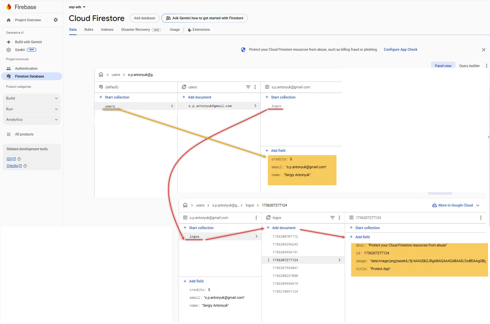

# AI Logo Generator

## Overview

Built a full-stack AI logo maker application using Next.js 15's  App Router, Firebase,  Gemini API & Hugging Face 

[Site](https://ai-logo-generator-sxidsvit.vercel.app/)

## Target Audience

People who are interested in creating logos for their brands or applications.

## Benefits

* The application is easy to use and has a user-friendly interface.
* The application provides a variety of templates and styles to choose from.
* The application allows users to customize their logos with different colors, fonts, and shapes.
* The application is free to use.


---

 

---

## Core Functionality

*The AI Finance Platform offers a range of functionalities to support your investment journey*:

* **User Authentication:** Securely create an account and manage your profile information.
* **Investment Analysis:** Utilize AI-powered tools to analyze market trends and identify potential investment opportunities.
* **Data Visualization:** Gain insights from interactive charts and graphs that represent financial data.
* **Portfolio Management:** Track your investments and monitor performance over time. 


## Tech Stack

**Frontend (Client-Side):**

* **Next.js 15:** Provides a robust and performant foundation for the user interface.
* **Tailwind CSS & Shadcn UI:** Enables the creation of a visually appealing and responsive user interface.
* **Clerk:** Simplifies user authentication and authorization processes.
* **Hagging Face** Platform for developing, sharing, and deploying machine learning models, particularly in natural language processing. It provides tools, pre-trained models, and datasets to accelerate AI development and collaboration.
* **Replicate** Platform that allows developers to run machine learning models in the cloud with a simple API, making it easy to integrate AI capabilities into applications without managing complex infrastructure


**Backend (Server-Side):**

* **Firebase** Сomprehensive platform developed by Google for building and managing mobile and web applications, providing services like authentication, real-time databases, cloud storage, and hosting. 


 

---
<br />

 *Configuration: Make sure to create a `.env` file with following variables*

```js
NEXT_PUBLIC_GEMINI_API_KEY=
NEXT_PUBLIC_CLERK_PUBLISHABLE_KEY=
CLERK_SECRET_KEY=
NEXT_PUBLIC_FIREBASE_API_KEY=
HUGGING_FACE_API_KEY=
REPLICATE_API_TOKEN=

```

## Getting Started

1. Visit the AI Logo Generator website: [Site](https://ai-logo-generator-sxidsvit.vercel.app/)
2. Create an account using the secure sign-up process.
3. Explore the platform's features and functionalities to familiarize yourself with its offerings.


## Contact:

[][linkedin]

[linkedin]: https://www.linkedin.com/in/sergiy-antonyuk/

---

##### Acknowledgements

*A special thanks to [you](https://www.youtube.com/@tubeguruji) for your invaluable contributions and inspiration.*
